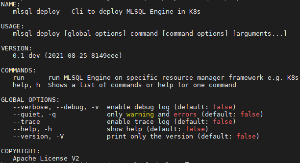

# 通过 Byzer-K8S 工具部署

本文描述了如何部署 Byzer-lang K8S 镜像，并体验基本功能。总体分为三步，环境搭建，部署，体验功能。


### Step1: 环境搭建

#### 1. 编译部署工具

从 [Go 官网](https://golang.org/dl/) 下载安装 Go 1.16.7，该版本经过测试。

> 我们没有测试过 Go 1.17，请慎用。

从 [Github](https://github.com/byzer-org/byzer-k8s) 获取部署工具代码, 配置 [Goproxy](https://github.com/goproxy/goproxy.cn) ,
并在项目根目录执行命令开始编译

```shell
make all
```

完成后, 执行命令:

```shell
./mlsql-deploy -h
```

结果如下图:

  

#### 2. 安装并配置 K8S

若您使用个人电脑，推荐使用 [Minikube](https://minikube.sigs.k8s.io/docs/)，仅需 1 条命令就能启动单机版 K8S，它支持 Linux/MacOS/Windows。我们已经成功部署至 Ubuntu 20.04 minikube 1.23.0。下载后，执行以下命令启动 K8S，配置代理能大大加速下载镜像速度。

```shell
minikube start
```

若安装生产环境 K8S 集群，请参考 [13 - Byzer（原 MLSQL） on K8S（1） - K8S安装](https://mp.weixin.qq.com/s?__biz=MzI5NzEwODUwNw==&mid=2247483782&idx=1&sn=642b036caf8ab6a07ae7cdebe347acc3&chksm=ecbb54f2dbccdde4f6555f4e1c62403f073cf4e50d6aa66034700b2d9a8f97361857e518edc1&scene=21#wechat_redirect)。

#### 3. 配置 JuiceFS

参考 [Byzer-K8S 文档 - 配置 JuiceFS](https://github.com/byzer-org/byzer-k8s#juicefs-file-system-setup)。

> 请注意: 需要在 K8S 每台服务器配置 JuiceFS


### Step2: 部署

#### 1. 配置 K8S 密钥

启动 Byzer-lang Driver Pod 时，K8S 会从 [Docker hub](https://hub.docker.com/) 拉取镜像，因而需要这一步。请执行以下命令：

```shell
kubectl create secret docker-registry regcred \
--docker-username=<docker hub 用户名> \
--docker-password=<docker hub 密码> \
-n default
```

#### 2. 部署 Byzer-lang

使用 Byzer-K8S 工具，部署至 K8S 集群。例子如下：

```shell
# 请根据实际情况修改目录 
/work/byzer-k8s/byzer-k8s run \
  --kube-config  ~/.kube/config \
  --engine-name mlsql-engine \
  --engine-image byzer/byzer-lang-k8s:3.1.1-2.2.1 \
  --engine-executor-core-num 1 \
  --engine-executor-num 1   \
  --engine-executor-memory 1024 \
  --engine-driver-core-num 1   \
  --engine-driver-memory 1024 \
  --engine-access-token mlsql   \
  --engine-jar-path-in-container local:///home/deploy/mlsql/libs/streamingpro-mlsql-spark_3.0_2.12-2.2.1.jar   \
  --storage-name  jfs \
  --storage-meta-url redis://192.168.50.254:6379/1
```

参数说明如下:

| 参数名                       | 说明                                                         |
| ---------------------------- | ------------------------------------------------------------ |
| kube-config                  | K8S 配置文件。Byzer-k8S 会读取 K8S ApiServer 地址            |
| engine-name                  | K8S Deployment 名称，请取一个有实际意义的名字                |
| engine-image                 | 请不要改，这是 K8S 从 docker hub 拉取的镜像名                |
| engine-executor-core-num     | 每个 Spark Executor 核数                                     |
| engine-executor-num          | Spark executor 数量                                          |
| engine-executor-memory       | Spark executor 堆内存，单位 MB                               |
| engine-driver-core-num       | Spark driver 核数                                            |
| engine-driver-memory         | Spark driver 堆内存, 单位 MB                                 |
| engine-access-token          | 调用 Byzer-lang API 所需 Token                               |
| engine-jar-path-in-container | Byzer-lang jar 在容器内路径，请不要修改。启动 Spark Driver 需要它。 |
| storage-name                 | 执行 JuiceFS format命令时，指定的名称                        |
| storage-meta-url             | JuiceFS 的元数据库连接串                                     |


### Step3: 体验功能

等待 Byzer-K8S 完成，点击显示的 http://<your_k8s>:9003 ，开始体验。


### 构建 Byzer 引擎 K8S 镜像

> 写在最后：若想要 [重新构建 K8S 镜像](https://github.com/byzer-org/byzer-build#building-byzer-engine-k8s-image)，请使用如下命令：

``` shell
./dev/bin/build-spark3-image.sh
```
