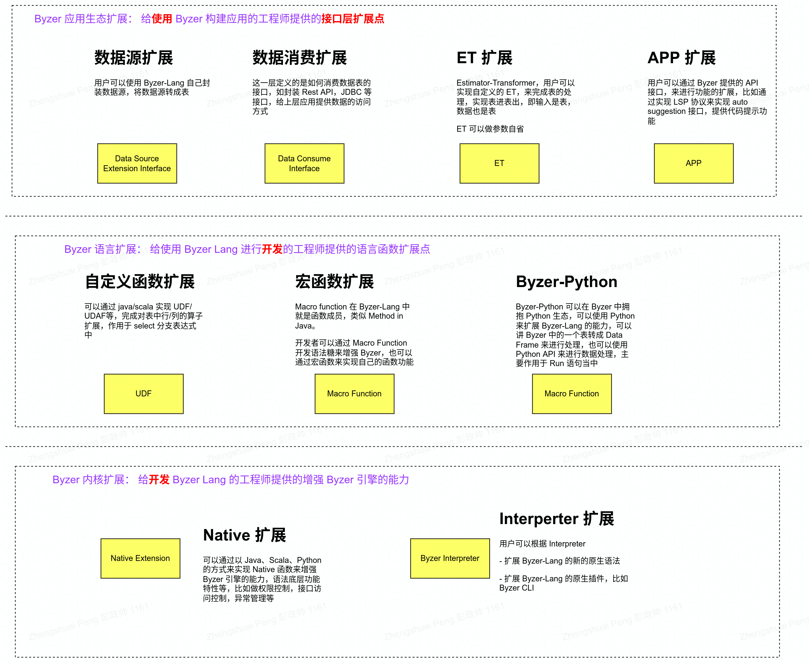

# Byzer Language 设计原理

### 设计理念

Byzer 作为一门面向 Data 和 AI 的新一代编程语言，在设计的时候存在了许多的考量：

第一点是我们希望在语言层面能够尽可能简单，减少上手的成本，所以采用了声明式语言（SQL-like）来设计，但是对于日常使用来讲，又希望保持一定的灵活性，所以 Byzer 在设计的时候，是融合了声明式语言和命令式语言的设计。

第二点是我们希望直接设计成一个解释型的语言，Byzer 目的是想要解决 Data Pipeline 处理和 AI 落地的效率问题，所以我们采用了解释型语言的设计

第三点是想要尽可能复用业界现有的强大生态，可以让语言的执行天然云原生和分布式，所以我们采用了 Spark/Ray 作为了语言的执行引擎，得益于 Spark 和 Python 的强大生态，Byzer 的生态也非常丰富。

在抽象语言能力的时候，数据领域的工作的实际上就是对数据的处理，事实的载体其实就是二维数据表，而 SQL 语言实际上就是抽象在二维数据表上的各种数据操作。所以 Byzer 语言在的一个核心设计就是**万物皆表（Everything is a table）**，我们希望开发者可以非常容易的将任何实体对象通过 Byzer 来抽象成一个二维表，然后基于表做各种数据的处理和训练。

同时 Byzer 社区的另一个产品 Byzer Notebook，是为 Byzer Language 开的 IDE 的工具，以 notebook 作为基本形式，提供了项目管理，代码提示等功能，还在持续迭代中。

### Byzer 语言架构

Byzer 的架构如下图：

我们可以看到 Byzer 作为一个解释性语言，拥有解释器（Interpreter）以及运行时环境 （Runtime），Byzer 的 Interpreter 会对 Byzer 的脚本做词法分析，预处理，解析等阶段，然后生成 Java/Scala/Python/SQL 等代码，然后提交到 Runtime 上进行执行。这里可以看出，生成的 Java 或 Scala 代码，就是 Byzer 的 Native 代码。

Byzer 使用 **Github 作为包管理器（Package Manager）**，有内置 lib 库和第三方 lib 库（lib 库是使用 Byzer 语言编写出的功能模块）

### Byzer 语言扩展点

讲到 Byzer 的扩展点，扩展点其实就是一个语言定义的各种接口，那么我们需要将 Byzer-Lang 自身的扩展和基于 Byzer-Lang 的应用生态的扩展进行区分，其实是面对两个不同的人群：
- 使用 Byzer-Lang 开发应用的工程师，利用 Byzer-Lang 编写业务代码逻辑和扩展
- 开发 Byzer-Lang 本身的工程师，增强 Byzer-Lang 的语言特性

Byzer-lang 从语言层面，是有 **变量（Variable）**，**函数（Macro Function）**,**包（Package）**，**模块（Lib）** 的定义和实现的，开发者可以通过 Macro Function 来封装 Byzer-Lang 代码，也可以通过 Macro Function 来实现 Byzer-Lang 的语法糖来增强 Byzer-Lang 的语法特性，也可以通过Package进行代码组织，使用 Byzer-lang 开发可供第三方使用功能的库。

#### Byzer-lang 应用生态扩展

这个层面主要是面向使用 Byzer-lang ，具备 Scala/Java 开发能力的工程师。通过他可以增加 Byzer-lang 处理业务需求的能力。

从数据处理上，大致分为下面几类：

- **数据源扩展**（数据源扩展从接入数据和消费数据两个角度来进行区分）
  - 接入数据，讲数据源抽象成 Byzer 内的表
  - 消费数据，将 Byzer 处理过的数据通过 API 进行暴露，给下游进行消费
- **ET扩展**（`Estimator-Transformer`）：实现对表操作的扩展，常见的通过 ET 完成的一些扩展
  - UDF 函数
  - Byzer-Python，拥抱 Python 生态来扩展 Byzer 处理表的能力
  - `!plugin` 插件及插件管理
  - Macro Function 实际上也是 ET 的一个实现
- **App 扩展**： 通过 Byzer 的接口来实现应用功能的扩展
  - 比如通过实现 LSP 协议，暴露 auto-suggest 接口来完成 Byzer 的代码提示

#### Byzer 语言层扩展

该层扩展主要供 Byzer-lang 编码者使用，比如编写 Byzer 的库。

用户可以在 Byzer 语法中通过下列扩展点来拓展语言能力：
- Macro Function （宏函数）
- UDF 函数  (允许用户编写 Scala/Java UDF 函数，作用于 select / 分支条件表达式 中)
- Byzer-python ( 作用于 run 语句中。支持 Python脚本 )

#### Byzer-lang 内核层扩展：

这个层面的扩展点主要面向 Byzer-lang 的核心开发者的。通过这些扩展点，可以增强引擎的能力。本质上其实是增强 Byzer-Lang 的解释器

1. 生命周期扩展点来实现插件扩展，这里的生命周期则是指在 Runtime 初始化之前还是之后，比如 Byzer CLI，就是在 Runtime 初始化之前完成插件加载的
2. 新语法扩展点，比如新增一个语法关键字
3. 各种自定义功能扩展点，比如权限，接口访问控制，异常处理，请求清理 等。

#### IDE 支持  

Byzer-lang 目前支持纯Web 版本的， Byzer-notebook ， 也支持 VSCode 脚本和 notebook 能力。

Byzer-Lang 作为一门语言，需要能够支持各种 IDE， 完成诸如高亮，代码提示，运行等能力。目前比较流行的方式是实现 **LSP （language server protocol）**，这样在编辑器层或者是 IDE 层，可以直接基于 LSP 完成相关功能。官方目前已经实现了 VSCode 的支持。 参考： [byzer-desktop](https://github.com/byzer-org/byzer-desktop) ， [byzer-language server](https://github.com/byzer-org/byzer-extension/tree/master/mlsql-language-server)

在 Byzer-lang 是纯脚本式解释执行语言。 所以可以使用内置宏函数 `!show` 来实现参数自省，通过 **code suggestion api** 返回给调用方，完成代码的提示。
